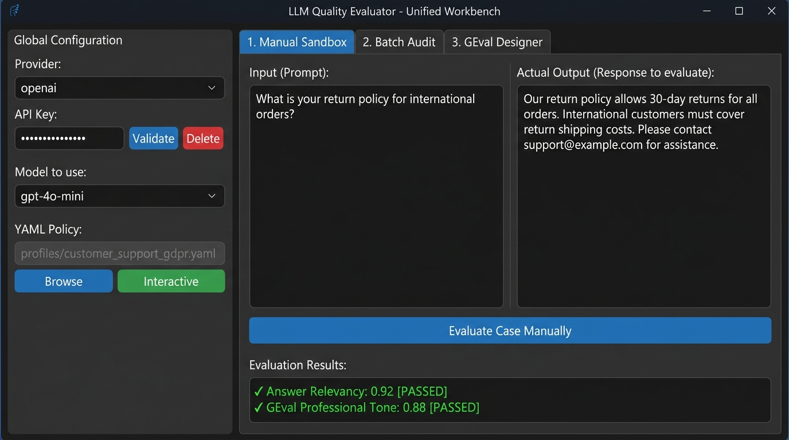
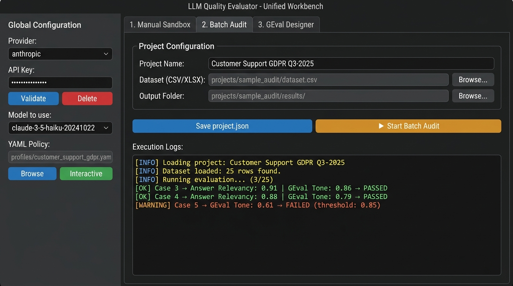

# LLM Quality Evaluator

> **A No-Code desktop workbench for auditing and evaluating LLM-powered applications.**  
> Built for QA teams, Product Owners, and AI Compliance Auditors — not for Python developers.


[](https://github.com/brunofulia/LLM_Quality_Evaluator/releases/latest)


---

## What is LLM Quality Evaluator?

**LLM Quality Evaluator** is a desktop evaluation workbench that makes LLM quality assessment accessible to **non-technical teams**. It puts the power of [DeepEval](https://github.com/confident-ai/deepeval) behind a clean graphical interface, eliminating the need to write Python scripts or configure evaluation frameworks manually.

> **This project is not a replacement for DeepEval.**  
> It is a desktop application *built on top of* DeepEval to make LLM evaluation accessible to non-technical users.

Whether you need to spot-check a single LLM response or run a full compliance audit against hundreds of cases, LLM Quality Evaluator handles it through a point-and-click workflow.

---

## Who is this for?

| Role | Use Case |
|---|---|
| 🧪 **QA Functional / Business Testers** | Validate LLM responses against quality thresholds without coding |
| 📋 **Product Owners** | Audit feature outputs before releases |
| 🤖 **AI Consultants** | Deliver structured evaluation reports to clients |
| ⚖️ **Compliance Auditors** | Verify that AI responses meet regulatory and policy standards |

> **Not designed for:** Python developers or ML engineers who prefer using DeepEval's SDK directly.

---

## Key Features

- 🖥️ **Desktop GUI Workbench** — Full graphical interface (CustomTkinter), no terminal required
- 🔍 **Manual Sandbox** — Test a single prompt/response pair interactively and see results in real time
- 📦 **Batch Audit Mode** — Evaluate entire datasets (CSV, JSON, Excel) in one click with async progress logging
- 📐 **YAML Evaluation Policies** — Reusable, human-readable policy files that define *what* to measure, *with what thresholds*, and *under what business criteria*
- ✏️ **GEval Designer** — Create custom natural-language evaluation criteria without writing any code
- 📊 **Auto Reports** — Automatic Excel and HTML report generation at the end of every batch audit
- 🔌 **Multi-Provider** — OpenAI, Anthropic, Google Gemini, Groq, and a Mock provider for offline testing
- 🏛️ **Clean Architecture** — Engine is 100% decoupled from the UI; reusable as a standalone Python library
- 🖥️ **CLI / TUI Mode** — Full-featured interactive terminal interface for power users and CI pipelines

---

## ⬇️ Download & Run — No Python Required

> **For non-technical users:** Download the pre-compiled Windows executable and run it directly — no Python, no terminal, no installation needed.

| Platform | Download | Notes |
|---|---|---|
| **Windows (x64)** | [**📥 Download v2.0 (.zip)**](https://github.com/brunofulia/LLM_Quality_Evaluator/releases/latest) | Extract and run `LLM_Quality_Evaluator.exe` |

### Steps
1. Go to the [**Releases page**](https://github.com/brunofulia/LLM_Quality_Evaluator/releases/latest)
2. Download `LLM_Quality_Evaluator_v2.0_Windows.zip`
3. Extract the ZIP to any folder on your machine
4. Double-click **`LLM_Quality_Evaluator.exe`** inside the extracted folder
5. On first launch: select your **Provider**, enter your **API Key**, and click **Validate**

> **Note:** Windows Defender SmartScreen may show a warning on first run ("Unknown publisher"). Click **"More info" → "Run anyway"** — the app is safe and open source.

---

## Screenshots

**Tab 1 — Manual Sandbox:** Test individual prompt/response pairs and get immediate metric feedback.



**Tab 2 — Batch Audit:** Run full dataset evaluations with real-time log streaming and auto report generation.



---

## Architecture

LLM Quality Evaluator follows a strict **Clean Architecture** separation: the evaluation engine has **zero dependencies** on the UI layer.

```
llm-quality-evaluator/
├── engine/                     # Core Python Library (Domain Logic)
│   ├── evaluation/             # Evaluator engine & DeepEval adapter
│   ├── profiles/               # YAML policy loader & custom metrics
│   ├── exporters/              # Excel & HTML report generators
│   ├── config/                 # Project config & env variables
│   ├── discovery/              # Model discovery (fetches available models per provider)
│   ├── exceptions/             # Custom domain exceptions
│   └── logger.py               # Centralized logging
│
├── ui/                         # Client Layer (Thin, Replaceable)
│   ├── desktop/                # CustomTkinter Desktop GUI (v2.0)
│   └── tui/                    # Rich CLI / Terminal Interactive UI (v1.0)
│
├── profiles/                   # Evaluation Policy collection (.yaml)
├── projects/                   # Audit Project containers
│   └── sample_audit/           # Ready-to-use example project
├── templates/                  # Base templates
├── cli.py                      # CLI entry point
└── requirements.txt
```

### Architectural Principles (Non-Negotiable)

1. **Business logic never depends on the UI** — `engine/` has no imports from `ui/`
2. **Engine is 100% Python Native & Cross-Platform** — no OS scripts
3. **Profiles must remain human-readable** — YAML only
4. **Templates must be editable without code**
5. **Every project must be reproducible from `project.json` alone**
6. **Data ingestion abstraction** — engine consumes normalized in-memory datasets via `pandas`

---

## Quick Start

### Prerequisites

- Python 3.10+
- An API key from at least one supported provider (OpenAI, Anthropic, Google, or Groq)

### Installation

```bash
# 1. Clone the repository
git clone https://github.com/brunofulia/LLM_Quality_Evaluator.git
cd LLM_Quality_Evaluator

# 2. Create and activate a virtual environment
python -m venv venv
source venv/bin/activate        # macOS / Linux
venv\Scripts\activate           # Windows

# 3. Install dependencies
pip install -r requirements.txt
```

### Launch the Desktop GUI

```bash
python ui/desktop/app.py
```

On first launch:
1. Select your **Provider** (OpenAI, Anthropic, Google, Groq) from the sidebar dropdown
2. Paste your **API Key** and click **Validate** — the app will fetch available models automatically
3. Select a **YAML Policy** (use `profiles/customer_support_gdpr.yaml` as a starting point)
4. Navigate to the desired tab and start evaluating

### Launch the CLI / TUI

```bash
python cli.py
```

---

## How It Works

### 1. Projects (`project.json`)

Every evaluation session is organized around a **Project**. A project is fully defined by a `project.json` file:

```json
{
  "version": "1.0",
  "name": "Customer Support GDPR Audit",
  "provider": "openai",
  "model": "gpt-4o-mini",
  "profile_path": "profiles/customer_support_gdpr.yaml",
  "dataset_path": "projects/sample_audit/dataset.csv",
  "output_dir": "projects/sample_audit/results/"
}
```

Any project can be reproduced by pointing the application at its `project.json` — no manual re-configuration needed.

### 2. Evaluation Policies (YAML Profiles)

A YAML profile defines the **evaluation policy**: which metrics to run, with what thresholds, and for what business domain.

```yaml
profile_name: "Customer Support GDPR & Policy Gate"
description: "Policy gate for privacy, compliance, and professional tone."
domain: "E-Commerce / GDPR"
recommended_model: "gpt-4o-mini"
metrics:
  - name: "Answer Relevancy"
    threshold: 0.80
  - name: "GEval Professional Tone & Privacy"
    criteria: "Response must be formal and must not disclose PII or unverified promises."
    threshold: 0.85
```

Profiles are reusable assets — the same policy can be applied to different datasets or providers.

### 3. Custom Metrics (GEval Designer)

The **GEval Designer** tab lets you define custom evaluation criteria using natural language, without writing any code. Criteria are saved as JSON files in the library and become available as custom metrics when creating policies.

---

## Supported Providers

| Provider | Models | Notes |
|---|---|---|
| **OpenAI** | GPT-4o, GPT-4o-mini, GPT-4-turbo, etc. | Full support |
| **Anthropic** | Claude 3.5 Haiku, Claude 3.5 Sonnet, etc. | Full support |
| **Google** | Gemini 1.5 Pro, Gemini 2.0 Flash, etc. | Full support |
| **Groq** | Llama-3.3, Mixtral, etc. | JSON parsing may vary; adapter handles gracefully |
| **Mock** | — | Offline testing, no API key required |

---

## Supported Metrics

LLM Quality Evaluator exposes all DeepEval metrics through its adapter layer:

| Metric | Keyword in YAML | Description |
|---|---|---|
| **Answer Relevancy** | `Answer Relevancy` | Measures how relevant the response is to the input |
| **Hallucination** | `Hallucination` | Detects fabricated or unsupported claims in the response |
| **Toxicity** | `Toxicity` | Flags harmful, offensive, or toxic language |
| **Bias** | `Bias` | Detects biased statements in model outputs |
| **Summarization** | `Summarization` | Evaluates quality of summarization outputs |
| **GEval (Custom)** | `GEval` or any metric with a `criteria:` field | Any criterion defined in natural language — no coding required |

> **Note:** Faithfulness, Contextual Precision, and Contextual Recall are not yet wired in the current adapter. They are planned for a future release.
> New DeepEval metrics can be added by extending the `_map_metric` method in [`deepeval_adapter.py`](engine/evaluation/adapters/deepeval_adapter.py).

---

## Dataset Format

The engine accepts **CSV, JSON, and Excel (.xlsx)** datasets. Expected columns:

| Column | Required | Description |
|---|---|---|
| `id` | ⬜ | Optional row identifier. Auto-generated as `row_N` if absent |
| `input` | ✅ | The prompt or question sent to the LLM |
| `actual_output` | ✅ | The LLM's response to evaluate |

> **Note:** `expected_output` and `context` are not consumed by the engine in the current version. The adapter uses `input` as the internal context fallback for metrics that require it.

A ready-to-use example dataset is available at [`projects/sample_audit/`](projects/sample_audit/).

---

## Roadmap

| Version | Description | Status |
|---|---|---|
| **v1.0** | Core engine + Rich CLI / TUI interactive interface | ✅ Released |
| **v2.0** | Desktop GUI workbench (CustomTkinter) | [✅ Released — Download](https://github.com/brunofulia/LLM_Quality_Evaluator/releases/latest) |
| **v3.0** | Evaluation history & run comparison, PDF export, plugin system | 🔜 Planned |

---

## Contributing

Contributions are welcome. Please open an issue first to discuss what you would like to change.

For code contributions:

```bash
# Run the test suite
pytest tests/ -v
```

> All tests run without real LLM calls (Mock provider is used in the test suite).

---

## License

This project is licensed under the **MIT License** — see the [LICENSE](LICENSE) file for details.

---

## Acknowledgements

- [DeepEval](https://github.com/confident-ai/deepeval) by Confident AI — the evaluation engine powering the metric layer
- [CustomTkinter](https://github.com/TomSchimansky/CustomTkinter) — the modern Tkinter UI framework
- [Rich](https://github.com/Textualize/rich) — terminal formatting for the CLI/TUI interface

